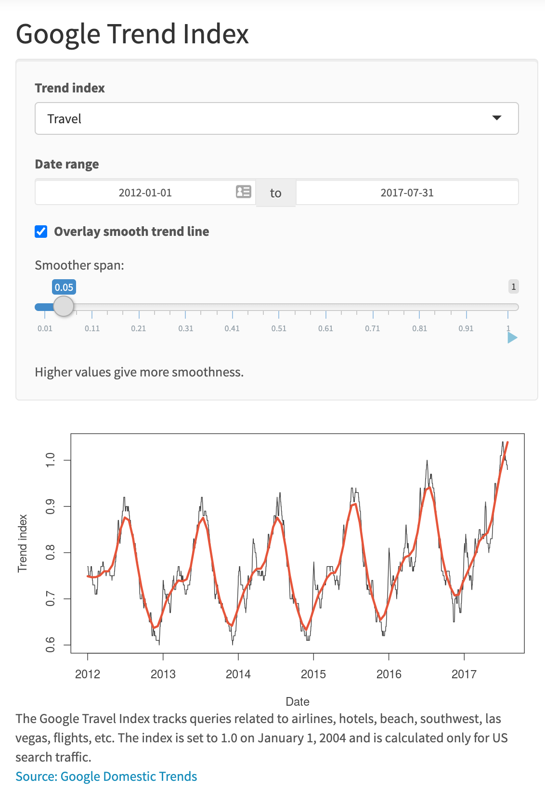
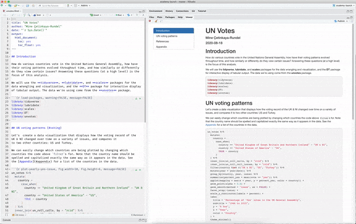
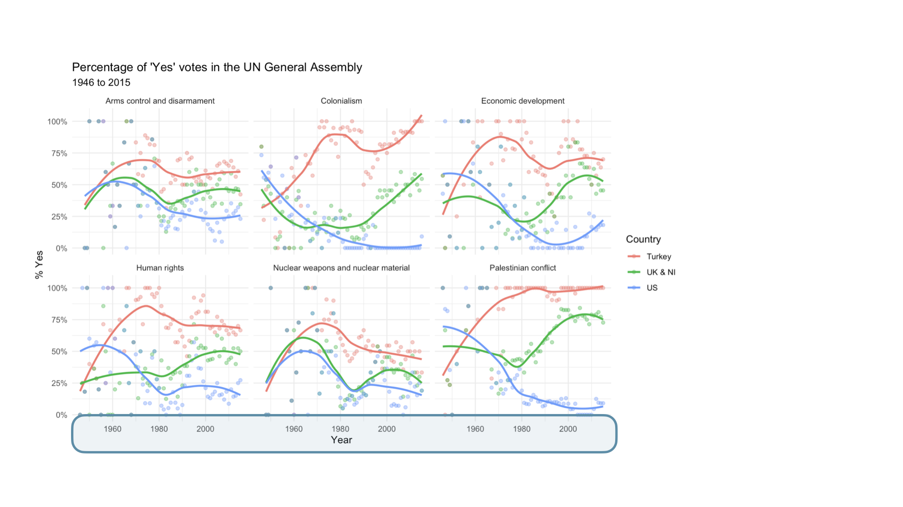

```{r child = "../setup.Rmd"}
```

```{r packages, echo=FALSE, message=FALSE, warning=FALSE}
library(tidyverse)
library(emo)
```

class: middle

# Hello world!

---

## Data science

.pull-left-wide[
- Data science is an exciting discipline that allows you to turn raw data into understanding, insight, and knowledge. 

- We're going to learn to do this in a `tidy` way -- more on that later!

- This is a course on introduction to data science, with an emphasis on statistical thinking. 

- We will also emphasize drawing environmental insights, but the tools you will learn in this course can be applied to any discipline.
]

---

## Course FAQ

.pull-left-wide[
**Q - What data science background does this course require?**  
A - None.

**Q - Is this an intro stat course?**  
A - While statistics $\ne$ data science, they are very closely related and have tremendous of overlap. Hence, this course is a great way to get started with statistics. However this course is *not* your typical high school/college statistics course.

**Q - Will we be doing computing?**   
A - Yes.
]

---

## Course FAQ

.pull-left-wide[
**Q - Is this an intro CS course?**  
A - No, but many themes are shared.

**Q - What computing language will we learn?**  
A - R.

**Q: Why not language X?**  
A: We can discuss that over `r emo::ji("coffee")`.
]

---

## One link to rule them all...

... where you can find everything!

<br>

.larger[
.center[
[**https://enst321-2022sp.netlify.app/**](https://enst321-2022sp.netlify.app/)
]
]

---

class: middle

# Software

---

```{r echo=FALSE, out.width="75%", fig.align="left"}
knitr::include_graphics("img/excel.png")
```

---

```{r echo=FALSE, out.width="75%", fig.align="left"}
knitr::include_graphics("img/r.png")
```

---

```{r echo=FALSE, out.width="73%", fig.align="left"}
knitr::include_graphics("img/rstudio.png")
```

---

class: middle

# Data science life cycle

---

```{r echo=FALSE, out.width="90%", fig.align="left"}
knitr::include_graphics("img/data-science-cycle/data-science-cycle.001.png")
#from IDS textbook
```

---

```{r echo=FALSE, out.width="90%", fig.align="left"}
knitr::include_graphics("img/data-science-cycle/data-science-cycle.002.png")
```

---

```{r echo=FALSE, out.width="90%", fig.align="left"}
knitr::include_graphics("img/data-science-cycle/data-science-cycle.003.png")
```

---

```{r echo=FALSE, out.width="90%", fig.align="left"}
knitr::include_graphics("img/data-science-cycle/data-science-cycle.004.png")
```

---

```{r echo=FALSE, out.width="90%", fig.align="left"}
knitr::include_graphics("img/data-science-cycle/data-science-cycle.005.png")
```

---

```{r echo=FALSE, out.width="90%", fig.align="left"}
knitr::include_graphics("img/data-science-cycle/data-science-cycle.006.png")
```

---

.pull-left[
```{r echo=FALSE, out.width="75%", fig.align="left"}

```
]
.pull-right[
```{r echo=FALSE, out.width="90%", fig.align="right"}
knitr::include_graphics("img/data-science-cycle/data-science-cycle.006.png")
```
]

---

.pull-left[
```{r echo=FALSE, out.width="75%", fig.align="left"}

```
]
.pull-right[
```{r echo=FALSE, out.width="90%", fig.align="right"}
knitr::include_graphics("img/data-science-cycle/data-science-cycle.006.png")
```
```{r echo=FALSE}
travel <- tribble(
  ~date,              ~season,
  "23 January 2017",  "winter",
  "4 March 2017",     "spring",
  "14 June 2017",     "summer",
  "1 September 2017", "fall",
  "...", "..."
)
travel
```
]

---

```{r echo=FALSE, out.width="90%", fig.align="left"}
knitr::include_graphics("img/data-science-cycle/data-science-cycle.007.png")
```

---

```{r echo=FALSE, out.width="90%", fig.align="left"}
knitr::include_graphics("img/data-science-cycle/data-science-cycle.008.png")
```

---

```{r echo=FALSE, out.width="90%", fig.align="left"}
knitr::include_graphics("img/data-science-cycle/data-science-cycle.009.png")
```

---

```{r echo=FALSE, out.width="85%", fig.align="left"}

#raw code on left, output on right. goal for the first week or two is to learn how to write raw code to get readable output
```

---

class: middle

# Let's dive in!

---

background-image: url("img/unvotes/unvotes-01.jpeg")

---

class: inverse

```{r echo=FALSE, out.width="100%"}
knitr::include_graphics("img/unvotes/unvotes-02.jpeg")
```

---

class: inverse

```{r echo=FALSE, out.width="100%"}
knitr::include_graphics("img/unvotes/unvotes-03.jpeg")
#for each year with data, % of resolutions in that category the country voted yes on
```

---

class: inverse

```{r echo=FALSE, out.width="100%"}

```

---

class: inverse

```{r echo=FALSE, out.width="100%"}
knitr::include_graphics("img/unvotes/unvotes-05.jpeg")
```

---

class: inverse

```{r echo=FALSE, out.width="100%"}
knitr::include_graphics("img/unvotes/unvotes-06.jpeg")
```

---

class: inverse

```{r echo=FALSE, out.width="100%"}
knitr::include_graphics("img/unvotes/unvotes-07.jpeg")
#how to actually make visualizaiton? 3 datasets - how countries voted, role calls (each voting session), df linking role call to particular issue. 
```

---

class: inverse

```{r echo=FALSE, out.width="100%"}
knitr::include_graphics("img/unvotes/unvotes-08.jpeg")
#not getting into too much code, but we can see the names of the dataframes. 
```

---

class: inverse

```{r echo=FALSE, out.width="100%"}
knitr::include_graphics("img/unvotes/unvotes-09.jpeg")
#We can also see key words - join, filter - hinting at what the code is doing. Also see ggplot - plotting something. Being able to take a look at the data is key - plotting. 
```

---

class: inverse

```{r echo=FALSE, out.width="100%"}
knitr::include_graphics("img/unvotes/unvotes-10.jpeg")
```

---

class: inverse

```{r echo=FALSE, out.width="100%"}
knitr::include_graphics("img/unvotes/unvotes-11.jpeg")
```

---

class: inverse

```{r echo=FALSE, out.width="100%"}
knitr::include_graphics("img/unvotes/unvotes-12.jpeg")
```

---

class: inverse

```{r echo=FALSE, out.width="100%"}
knitr::include_graphics("img/unvotes/unvotes-13.jpeg")
#words rendered as text, code rendered as code
```

---

class: inverse

```{r echo=FALSE, out.width="100%"}
knitr::include_graphics("img/unvotes/unvotes-14.jpeg")
#also see metadata info at top. Rules for pretty output. We'll be writing a lot of documents like this in this course. 
```

---


---

