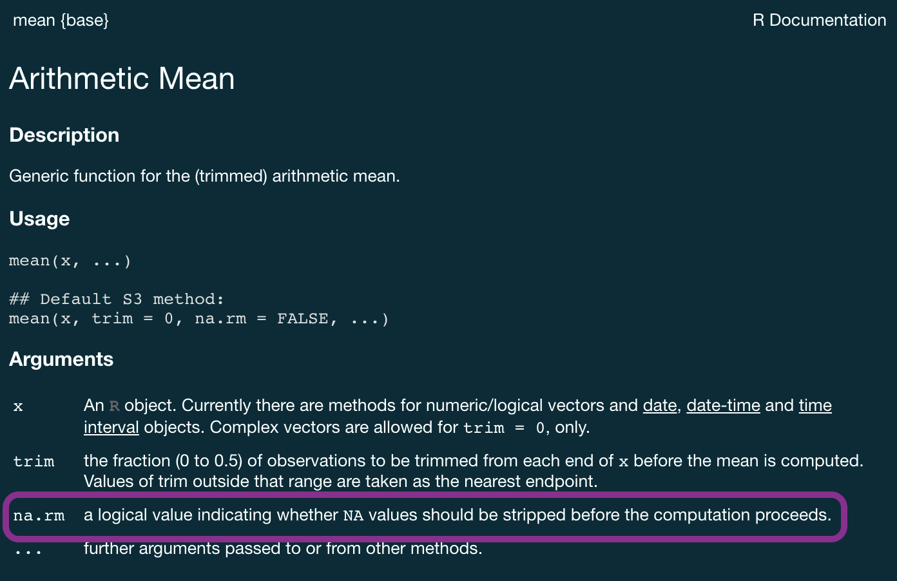

```{r child = "../setup.Rmd"}
```

```{r packages, echo=FALSE, message=FALSE, warning=FALSE}
library(tidyverse)
library(DT)
library(scales)
library(lubridate)
```

class: middle

# Why should you care about data types?

---

## Example: Cat lovers

A survey asked respondents their name and number of cats. The instructions said to enter the number of cats as a numerical value.

```{r message=FALSE}
cat_lovers <- read_csv("data/cat-lovers.csv")
```

```{r echo=FALSE}
cat_lovers
```

---

## Oh why won't you work?!

```{r}
cat_lovers %>%
  summarise(mean_cats = mean(number_of_cats))
```

---

```{r eval=FALSE}
?mean
```

```{r echo=FALSE, caption="Help for mean", out.width="75%"}

```

---

## Oh why won't you still work??!!

```{r}
cat_lovers %>%
  summarise(mean_cats = mean(number_of_cats, na.rm = TRUE))
```

---

## Take a breath and look at your data

.question[
What is the type of the `number_of_cats` variable?
]

```{r}
glimpse(cat_lovers)
```

---

## Let's take another look

.small[
```{r echo=FALSE}
options(htmltools.preserve.raw = FALSE)
cat_lovers %>%
  datatable()
```
]

---

## Sometimes you might need to babysit your respondents

.midi[
```{r}
cat_lovers %>%
  mutate(number_of_cats = case_when(
    name == "Ginger Clark" ~ 2,
    name == "Doug Bass"    ~ 3,
    TRUE                   ~ as.numeric(number_of_cats)
    )) %>%
  summarise(mean_cats = mean(number_of_cats))
```
]

---

## Always you need to respect data types

```{r}
cat_lovers %>%
  mutate(
    number_of_cats = case_when(
      name == "Ginger Clark" ~ "2",
      name == "Doug Bass"    ~ "3",
      TRUE                   ~ number_of_cats
      ),
    number_of_cats = as.numeric(number_of_cats)
    ) %>%
  summarise(mean_cats = mean(number_of_cats))
```

---

## Now that we know what we're doing...

```{r}
cat_lovers <- cat_lovers %>% #<<
  mutate(
    number_of_cats = case_when(
      name == "Ginger Clark" ~ "2",
      name == "Doug Bass"    ~ "3",
      TRUE                   ~ number_of_cats
      ),
    number_of_cats = as.numeric(number_of_cats)
    )
```

---

## Moral of the story

- If your data does not behave how you expect it to, type coercion upon reading in the data might be the reason.
- Go in and investigate your data, apply the fix, *save your data*, live happily ever after.

---

class: middle

.hand[.light-blue[now that we have a good motivation for]]  
.hand[.light-blue[learning about data types in R]]

<br>

.large[
.hand[.light-blue[let's learn about data types in R!]]
]

---

class: middle

# Data types

---

## Data types in R

- **logical**
- **double**
- **integer**
- **character**
- and some more, but we won't be focusing on those

---

## Logical & character

.pull-left[
**logical** - boolean values `TRUE` and `FALSE`

```{r}
typeof(TRUE)
```
]
.pull-right[
**character** - character strings

```{r}
typeof("hello")
```
]

---

## Double & integer

.pull-left[
**double** - floating point numerical values (default numerical type)

```{r}
typeof(1.335)
typeof(7)
```
]
.pull-right[
**integer** - integer numerical values (indicated with an `L`)

```{r}
typeof(7L)
typeof(1:3)
```
]

---

## Concatenation

Vectors can be constructed using the `c()` function.

```{r}
c(1, 2, 3)
c("Hello", "World!")
c(c("hi", "hello"), c("bye", "jello"))
```

---

## Converting between types

.hand[with intention...]

.pull-left[
```{r}
x <- 1:3
x
typeof(x)
```
]
--
.pull-right[
```{r}
y <- as.character(x)
y
typeof(y)
```
]

---

## Converting between types

.hand[with intention...]

.pull-left[
```{r}
x <- c(TRUE, FALSE)
x
typeof(x)
```
]
--
.pull-right[
```{r}
y <- as.numeric(x)
y
typeof(y)
```
]

---

## Converting between types

.hand[without intention...]

R will happily convert between various types without complaint when different types of data are concatenated in a vector, and that's not always a great thing!

.pull-left[
```{r}
c(1, "Hello")
c(FALSE, 3L)
```
]
--
.pull-right[
```{r}
c(1.2, 3L)
c(2L, "two")
```
]

---

## Explicit vs. implicit coercion

Let's give formal names to what we've seen so far:

--
- **Explicit coercion** is when you call a function like `as.logical()`, `as.numeric()`, `as.integer()`, `as.double()`, or `as.character()`


--
- **Implicit coercion** happens when you use a vector in a specific context that expects a certain type of vector

---

.midi[
.your-turn[
### .hand[Your turn!]

- RStudio Cloud > `AE 05 - Hotels + Data types` > open `type-coercion.Rmd` and knit.
- What is the type of the given vectors? First, guess. Then, try it out in R. 
If your guess was correct, great! If not, discuss why they have that type.
]
]

--

.small[
**Example:** Suppose we want to know the type of `c(1, "a")`. First, I'd look at: 

.pull-left[
```{r}
typeof(1)
```
]
.pull-right[
```{r}
typeof("a")
```
]

and make a guess based on these. Then finally I'd check:
.pull-left[
```{r}
typeof(c(1, "a"))
```
]
]

---

class: middle

# Special values

---

## Dates are special snowflakes

- Dates in R and computers in general are a rabbit hole we are not going down in this class:

  - What even *is* time? 
  - How do you translate a measure of the earth's rotation and orbit around the sun to something a computer understands??)

--

- **What you need to know:** R will often read in dates/times as character, so you need to coerce them into dates/times manually if you need R to know your data include dates/times

--

- Check the data type and coerce into a date, time, or datetime manually using functions from the  `lubridate` package

---

## Date/time types

- A **date**. Tibbles print this as <`date>`.

- A **time** within a day. Tibbles print this as `<time>`.

- A **date-time** is a date plus a time: it uniquely identifies an instant in time (typically to the nearest second). Tibbles print this as `<dttm>`. Elsewhere in R these are called POSIXct, but I don’t think that’s a very useful name.

---

## When you read in data, check data types

```{r}
flats <- read_csv("data/flats_sub_2015.csv")
flats
```

--

- `date` was read in as a character
- `time` was read in as a time
- `datetime` was read in as a character

---

## Why is this a problem?

```{r}
ggplot(flats, aes(x = datetime, y = depth_m)) +
  geom_point()
```

---

## Why is this a problem?

```{r}
ggplot(flats, aes(x = datetime, y = depth_m)) +
  geom_line()
```

---

## Using the `lubridate` functions

- `Lubridate` works out the date/time format once you specify the order of components 
- Identify the order in which year, month, and day appear in your dates
- Then arrange “y”, “m”, and “d” and "h", "m", and "s" in the same order. 
- That gives you the name of the `lubridate` function that will parse your date.
- The resulting output is always in yyy-mm-dd format

---

## Using the `lubridate` functions

```{r}
ymd("2017-01-31")

mdy("January 31st, 2017")

dmy("31-Jan-2017")

ymd_hms("2017-01-31 3:15:00")

ymd_hm("2017-01-31 3:15")

ymd(20170131)
```

---

## Coerce flats data into dates/datetimes

```{r}
flats1 <- flats %>%
  mutate(datetime = mdy_hm(datetime), #<<
         date = mdy(date)) #<<

flats1
```

---

## Now it knows the dates are actually datetimes

.panelset[
.panel[.panel-name[Plot]
```{r ref.label = "date-fix", echo = FALSE, warning = FALSE}
```
]
.panel[.panel-name[Code]
```{r date-fix, fig.show = "hide", warning = FALSE}
ggplot(flats1, aes(x = datetime, y = depth_m)) +
  geom_line() +
  labs(x = "", y = "Depth (m)") +
  theme_minimal()
```
]
]

---

## What if your data contain year, month, day, etc. in separate columns?

```{r}
flats2 <- flats1 %>%
  select(date, depth_m) %>%
  separate(date, c("year", "month", "day"))
flats2
```

---

## What if your data contain year, month, day, etc. in separate columns?

Use the `make_date()` or `make_datetime` functions!

```{r}
flats2 %>%
  mutate(date = make_date(year, month, day)) %>% #<<
  select(date, depth_m)
```

---

## What if you want to get individual components of date/time data?
Use the `year()`, `month()`, `mday()` (day of the month), `yday()` (day of the year, also known as julian day), `wday()` (day of the week), `hour()`, `minute()` or `second()` functions
.pull-left[
```{r}
datetime <- ymd_hms("2022-02-14 12:34:56")

year(datetime)

month(datetime)
```
]

.pull-right[
```{r}
mday(datetime)

yday(datetime)

wday(datetime)
```
]

